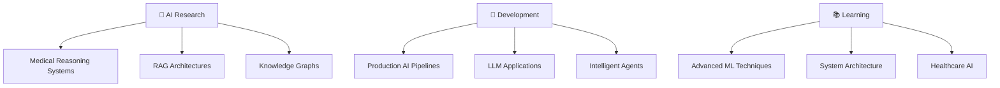

# Hi there, I'm Akhilesh Malthi 👋

<div align="center">
  
</div>

## 🚀 About Me

I'm a **Python programmer and AI engineer** specializing in **Retrieval-Augmented Generation (RAG)** and **Large Language Model applications**. I build production-ready AI agents and pipelines that deliver domain-specific search, reasoning, and orchestration at scale.

- 🔬 Currently working as **ML Research Intern** at Aegion Dynamic Solutions
- 🧠 Passionate about **Knowledge Graphs**, **Medical AI**, and **Intelligent Agents**
- 🏆 **1st Place** winner in AI Agents competition by Growstacks.AI
- 📊 Solved **400+ coding problems** (200+ on LeetCode)
- 💼 Delivered professional software consultancy worth **₹15,000**

## 🛠️ Tech Stack

### Languages & Frameworks


### AI/ML & Deep Learning


### Databases & Tools


## 🏆 Key Achievements

```python
class AkhileshAchievements:
    def __init__(self):
        self.diagnostic_accuracy_improvement = "85%"
        self.medical_entity_extraction_accuracy = "92%"
        self.data_processing_speed_improvement = "70% faster"
        self.students_mentored = "200+"
        self.competition_wins = ["1st Place - AI Agents", "2nd Place - SQL Contest"]
        self.certifications = [
            "IT Specialist - Python Programming",
            "IT Specialist - Java Development", 
            "IT Specialist - HTML & CSS"
        ]
```

## 🔥 Featured Projects

### 🏥 Medical Reasoning Chatbot
- **Think-On-Graph methodology** for medical reasoning
- **Knowledge Graphs** with Neo4j for enhanced reasoning
- **92% accuracy** in medical entity extraction
- **Tech Stack:** Python, LangChain, LlamaIndex, ChromaDB, Neo4j, FastAPI

### 🤖 TaskFlow Agent
- **AI-powered task management** via CrewAI agents
- **Multi-platform integration:** Slack, Trello, ClickUp
- **Streamlit UI** for configuration and visualization
- **Tech Stack:** Python, CrewAI, LangChain, Groq API, Streamlit

### ⚡ CodePG CLI Application
- **Automated coding playground** setup for multiple languages
- **AI-powered file generation** with custom specifications
- **VS Code integration** for seamless development
- **Tech Stack:** Python, LangChain, Llama 3.2, VS Code API

## 📊 GitHub Stats

<div align="center">
  
</div>

<div align="center">
  
</div>

<div align="center">
  
</div>

## 🌟 Current Focus



## 📫 Let's Connect!

<div align="center">
  
[](https://linkedin.com/in/YOUR_LINKEDIN)
[](mailto:akhileshmalthi2299@gmail.com)
[](https://github.com/YOUR_GITHUB_USERNAME)

</div>

---

<div align="center">
  
</div>

<div align="center">
  <i>⚡ "Building the future of AI, one algorithm at a time" ⚡</i>
</div>
