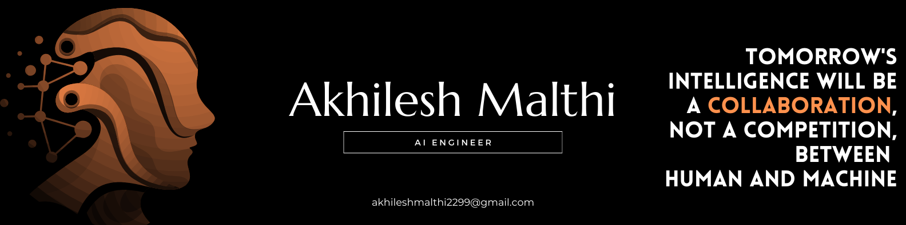

<!-- <div align="center">
  
</div> -->

<!-- <div align="center">
  
</div> -->



## About Me

I'm an AI Engineer focused on building intelligent systems and production-grade applications. I work with LLMs, AI agents, and scalable backend systems to create practical solutions for real-world problems.

I enjoy implementing research papers, building conversational AI tools, and architecting multi-agent systems. When I'm not coding, I'm solving algorithmic problems or exploring new AI frameworks.

## Skills

**AI & Machine Learning**
```
LangChain • LangGraph • Hugging Face Transformers • PyTorch • FastAPI
```

**Languages**
```
Python • JavaScript • TypeScript • Java • C++ • SQL
```

**Tools & Technologies**
```
Docker • AWS • PostgreSQL • Redis • Git • Next.js • React
```

## Currently Working On

Building AI-powered solutions at **LynkyAI** as an AI Engineer Intern:
---

<div align="center">
  
[](https://www.linkedin.com/in/akhilesh-malthi)
[](https://github.com/AkhileshMalthi)
[](mailto:akhileshmalthi2299@gmail.com)

</div>
